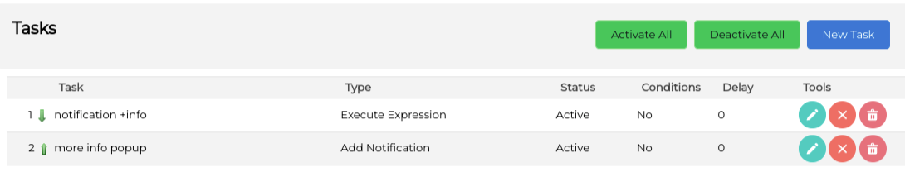
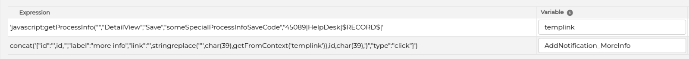

# BPM Process Flow More Information Settings

This module is part of the BPM perspective and serves to define a set of additional information that must be given to go from one step to the next.

This module defines a module where we will save additional information about a transition in the BPM flow. So, if we need to ask the user for some additional information when we transition from one state to another in a business process flow, this module will hold the information of

- where those fields will be saved (see the [Module BPM Information module](https://github.com/coreBOS/ModuleBPMInfo) for a template)
- what fields will be presented in the popup screen
- what field dependencies will be present
- what validation must be done in that popup form

Thus, this is a configuration module that extends the functionality of the [Process Flow Perspective](https://github.com/coreBOS/ProcessFlowPerspective). You will find some more information there.

## Standalone More Information Popup

This module can also be used separately from the BPM perspective. In the next video, I show how this can be done.

[](https://youtu.be/kZYlKG1fKUE)

You must:

- install the module that will hold the more information
- establish a one-to-one relation between the more information module and the module that the more information fields are for (HelpDesk in the video above)
- define a business action or validation map (or both) to trigger the more information popup

Let's discuss the business action call. The code is:

`javascript:getProcessInfo('','DetailView','Save','','45089|HelpDesk|$RECORD$|p1|p2')`

Where `45089` represents the cbProcessInfo record ID that defines what to show in the Popup and `HelpDesk` represents the module that the more information is related to. `$RECORD$` is the record ID of the HelpDesk.

In this case, what the function `getProcessInfo` does is use those values to load into the popup the correct records and fields and then execute a final javascript function when the More Information popup is saved. This last javascript can be one of two functions.

If the module (HelpDesk) has a BPM process flow related it will execute the function `bpmsaveinfo(module, return_id, mode, saveinfo)` if there is no BPM process related it will execute `finishProcessInfo(module, return_id, mode, saveinfo)`. Note that both functions have the same profile; they receive the module, record, and create/edit mode along with a JSON string representing the additional parameters added after the `$RECORD` in the element `ProcessInfoParams` and some other contextual information that may be helpful.

The `bpmsaveinfo` function will change the state of the BPM field and establish the relation between the two records. The `finishProcessInfo` just sets the relation between the records.

Now, two situations appear. One is when we want to open a standalone more information popup on a module with a BPM flow. In other words, the module has a BPM process flow but the more information popup that we need is NOT related to that flow, it is just a standalone more information popup. The current cbProcessInfo tries to help and detects on its own that there is a flow and it has to execute `bpmsaveinfo` instead of `finishProcessInfo` which is what you need in this case. So, to force the execution of `finishProcessInfo` we have to use the fourth parameter of the `getProcessInfo` function, like this:

`javascript:getProcessInfo('','DetailView','Save','finishProcessInfo','45089|HelpDesk|$RECORD$|p1|p2')`

That fourth parameter is forcing the execution of the `finishProcessInfo` function on the save action of the popup, which is what we need in this case.

The second situation is when we want to do more actions on the save of the popup. So, besides saving and establishing the relations, we need to execute some additional code. One way of doing this is using workflow tasks. Since the more information module is just a normal module and record save event, we can trigger any workflow task we need there and also any of the many events coreBOS gives us to plug into that save event. But, sometimes we need to execute some javascript and/or specific code on that save, to accomplish that we can use the fourth parameter with our own code. So, we insert our own javascript function with the same profile as the two this module uses:

`javascript:getProcessInfo('','DetailView','Save','someSpecialProcessInfoSaveCode','45089|HelpDesk|$RECORD$|p1|p2')`

`someSpecialProcessInfoSaveCode(module, return_id, mode, saveinfo)`

this function should call either `bpmsaveinfo` or `finishProcessInfo` first and then do whatever other actions need to be performed.

As an example let's suppose that we add a notification to a record with the more information event. Once the user clicks on the event and fills in the information, we want to mark the notification as "finished". So, when he clicks on the save button we have to also execute some code to change the status of the event. Let's go step by step.

First, we create a workflow to add the notification.



I separate the creation of the link to make it easier to maintain. The expressions look like this:



`'javascript:getProcessInfo("","DetailView","Save","someSpecialProcessInfoSaveCode","45089|HelpDesk|$RECORD$|'`

`concat('{"id":"',id,'","label":"more info","link":"',stringreplace('"',char(39),getFromContext('templink')),id,char(39),')","type":"click"}')`

Since the workflow expression editor only supports strings separated by single quotes, writing this type of expression is complicated. We have to use `char` to add quotes, so I create the whole link with double quotes and then replace them with single quotes. That way I only have to add one using `char`.

The final result, for a given record `11x89` looks like this:

`{"id":"11x89","label":"more info","link":"javascript:getProcessInfo('','DetailView','Save','someSpecialProcessInfoSaveCode','45089|HelpDesk|$RECORD$|11x89')","type":"click"}`

The important part of this expression is the `ID` property. I decided to use the same ID as the record triggering the notification workflow task, but that may not be enough in all cases. This ID represents the unique ID of the notification. If there were more than one notification on the same record (11x89 in this case) then we would have to add some other identifier to the notification or prefix it with some random string. You can use the `uniqid` workflow expression, for example.

I have added that ID to the JSON object and also as a parameter in the call, so I will get that parameter in my `someSpecialProcessInfoSaveCode` function and I will use it to change the status of the notification.

The final step is the function itself which looks like this:

```JS
function someSpecialProcessInfoSaveCode(module, return_id, mode, saveinfo) {
	finishProcessInfo(module, return_id, mode, saveinfo);
	let sinfo = JSON.parse(decodeURIComponent(saveinfo));
	let params = '&status=2&remid='+sinfo.ProcessInfoParams;
	ExecuteFunctions('setNotificationStatus', params);
}
```

That should do the trick. Note that since I am sending only one parameter in `getProcessInfo` call I can use `ProcessInfoParams` directly, if there were more we would need to split them.
